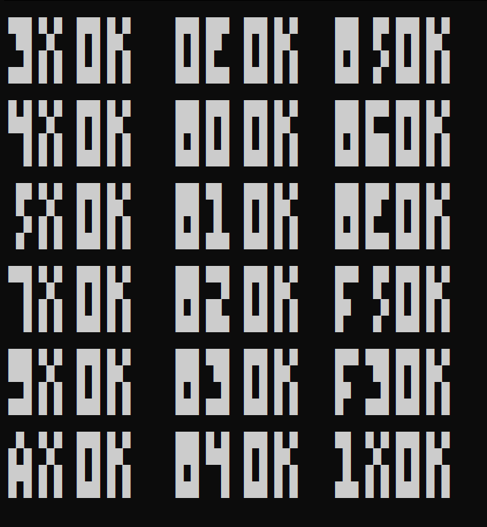
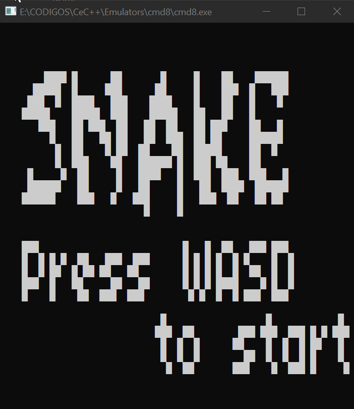

<h1 align="center">
  <br>
  cmd8
  <br>
</h1>
<h4 align="center">Emulador de chip8 feito em C++ usando o prompt de comando</h4>
</br>

## 💻 Info:
</br>

<div align="center">


</div>

Emulador de chip8 feito em C/C++ e rodando emcima do cmd(prompt de comando).
Funcionando apenas no Windows.

Programas testados:

- [test_opcode.ch8](https://github.com/corax89/chip8-test-rom/)
- [pong.rom](https://github.com/badlogic/chip8/tree/master/roms)
- [invaders.rom](https://github.com/badlogic/chip8/tree/master/roms)
- [1dcell.ch8](https://johnearnest.github.io/chip8Archive/play.html?p=1dcell)
- SI.ch8
- IBM_Logo.ch8
- 16AD.ch8


## 👨‍🏫 Usage:
</br>

Compile:
```
make
```

Running:
```
cmd8.exe <rom_file.ch8>
```

</br>